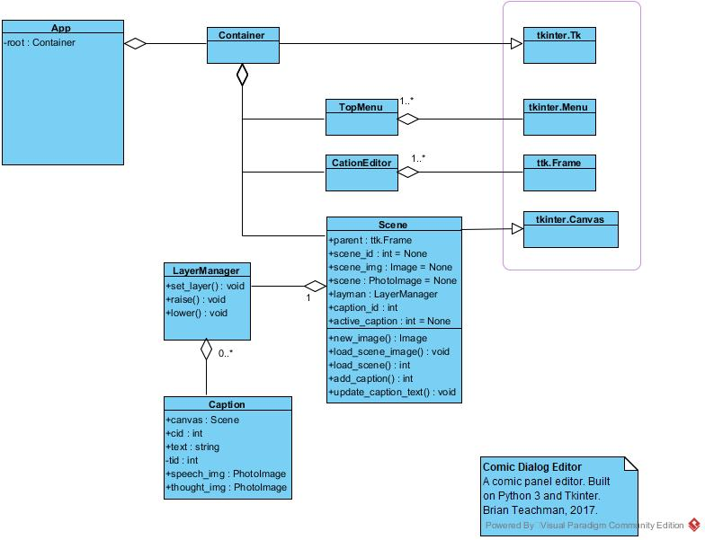

# Comic Dialog Editor

## 

## Here's some class diagrams

## Scene Class

## Caption Class

## References

1. [tkinter](https://docs.python.org/3/library/tkinter.html)
2. [tkdocs](https://tkdocs.com/)
3. [PIL](https://pillow.readthedocs.io/en/stable/handbook/index.html)
